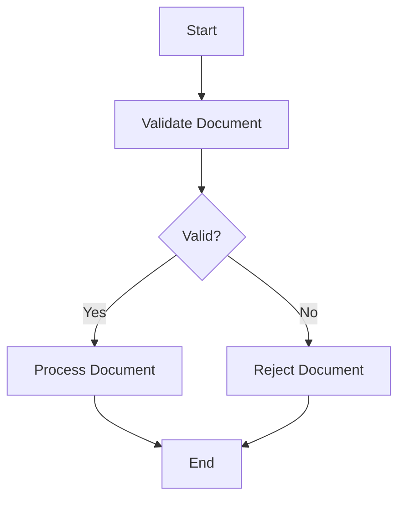

# AWS CDK Serverless Translation System

This repository contains the AWS Cloud Development Kit (CDK) code to deploy a serverless document translation system on AWS. The system automates the translation of documents uploaded to an S3 bucket, utilizing AWS Step Functions, Lambda, Bedrock, OpenSearch Serverless, and other AWS services.

## Table of Contents

- [Features](#features)
- [Architecture Overview](#architecture-overview)
- [Prerequisites](#prerequisites)
- [Setup & Installation](#setup--installation)
    - [1. Clone Repository](#1-clone-repository)
    - [2. Install Dependencies](#2-install-dependencies)
    - [3. Configure AWS Credentials](#3-configure-aws-credentials)
    - [4. Bootstrap CDK Environment](#4-bootstrap-cdk-environment)
- [Configuration](#configuration)
    - [Configuration File (`lib/config.ts`)](#configuration-file-libconfigts)
    - [Overriding Configuration](#overriding-configuration)
    - [Key Configuration Options](#key-configuration-options)
- [Deployment](#deployment)
- [Workflow Details](#workflow-details)
    - [Document Upload & Processing](#document-upload--processing)
    - [TMX File Processing](#tmx-file-processing)
- [Infrastructure Components](#infrastructure-components)
- [Running Tests](#running-tests)
- [Cleaning Up / Destroying the Stack](#cleaning-up--destroying-the-stack)
- [Directory Structure](#directory-structure)
- [Further Development & Considerations](#further-development--considerations)

## Features

-   Automated document translation triggered by S3 uploads.
-   Step Functions orchestration for a robust and observable workflow.
-   Leverages Amazon Bedrock for generative AI-powered translation and text embeddings.
-   Uses Amazon OpenSearch Serverless for creating a translation memory from TMX files (RAG pattern).
-   Modular infrastructure defined using CDK constructs.
-   Configurable email notifications for translation job status (via SES).
-   Includes Custom Resources for managing complex dependencies and configurations (e.g., IAM permissions, Lambda environment variables).

## Architecture Overview

This system consists of two primary asynchronous workflows triggered by S3 events, orchestrated mainly by AWS Step Functions and Lambda.



**Brief Explanation of Diagram Components:**

1.  **Document Translation Workflow**:
    -   A user uploads a document to the `Documents Bucket` (S3).
    -   An S3 Event triggers an EventBridge rule, which invokes the `DocumentProcessor` Lambda.
    -   The `DocumentProcessor` Lambda starts the `TranslationWorkflow` (Step Functions).
    -   The State Machine first validates the document (using the same `DocumentProcessor` Lambda code, though this could be a dedicated task).
    -   A `Map State` processes document sections in parallel by invoking the `TranslationProcessor` Lambda.
    -   The `TranslationProcessor` uses Bedrock for translation and can optionally query OpenSearch (our TMX translation memory) for relevant existing translations (RAG).
    -   After all sections are processed, the `DocumentCombiner` Lambda merges them into a final translated document, saved to S3.
    -   Optionally, the `NotificationSender` Lambda sends an email via SES.
2.  **TMX Ingestion Workflow**:
    -   A user uploads a TMX (Translation Memory eXchange) file to the `TMX Bucket` (S3).
    -   An S3 Event triggers an EventBridge rule, invoking the `TMXProcessor` Lambda.
    -   The `TMXProcessor` Lambda parses the TMX file, uses Bedrock to generate embeddings for the text segments.
    -   These embeddings are then indexed into the OpenSearch Serverless collection to build up the translation memory.

## Prerequisites

Before you begin, ensure you have the following installed and configured:

1.  **Node.js**: Version 18.x or later.
2.  **npm** (or **yarn**): Package manager for Node.js.
3.  **AWS Command Line Interface (AWS CLI)**: Configured with credentials for your AWS account. Verify with `aws configure list`.
4.  **AWS Cloud Development Kit (CDK)**: Install or update globally: `npm install -g aws-cdk`. Verify with `cdk --version`.
5.  **Docker**: Required by CDK for bundling Lambda function assets. Ensure the Docker daemon is running.

## Setup & Installation

Follow these steps to set up the project locally:

### 1. Clone Repository

```bash
git clone <repository-url>
cd <repository-directory>
```

### 2. Install Dependencies

Install the necessary Node.js packages defined in `package.json`:

```bash
npm install
# or if using yarn:
# yarn install
```

### 3. Configure AWS Credentials

Ensure your AWS CLI is configured with the credentials needed to deploy resources. You can typically do this via:

```bash
aws configure
```

Alternatively, use AWS environment variables (`AWS_ACCESS_KEY_ID`, `AWS_SECRET_ACCESS_KEY`, `AWS_SESSION_TOKEN`) or an IAM role. The deployment will use the default profile unless otherwise specified (e.g., `cdk deploy --profile your-profile-name`).

### 4. Bootstrap CDK Environment

If you haven't used CDK in the target AWS account and region before, you need to bootstrap the environment. This creates necessary resources (like an S3 bucket for assets) that CDK needs to deploy stacks.

```bash
cdk bootstrap aws://<YOUR_ACCOUNT_ID>/<YOUR_REGION>
# Example:
# cdk bootstrap aws://123456789012/us-east-1
```

Replace `<YOUR_ACCOUNT_ID>` and `<YOUR_REGION>` with your actual AWS account ID and the region where you intend to deploy the stack.

## Configuration

The stack's behavior can be customized through configuration.

### Configuration File (`lib/config.ts`)

The primary configuration definitions and default values are located in `lib/config.ts`. This file exports `getDefaultConfig()`, which provides the base configuration.

### Overriding Configuration

You can override the default configuration values using CDK context variables, typically set in `cdk.context.json` or via the `--context` (`-c`) flag during CDK commands.

**Example `cdk.context.json`:**

```json
{
  "senderEmail": "notifications@yourdomain.com",
  "tmxBucketName": "my-company-translation-memory",
  "documentsBucketName": "my-company-docs-to-translate",
  "features": {
    "emailNotifications": true
  },
  "bedrockConfig": {
      "embeddingModel": "amazon.titan-embed-text-v1",
      "translationModel": "anthropic.claude-v2"
  }
}
```

**Example using command-line context:**

```bash
cdk deploy -c senderEmail=notifications@yourdomain.com -c features.emailNotifications=true
```

Environment variables defined in `test/setup.ts` are primarily for testing and generally **do not** affect deployment configuration unless explicitly read within the CDK code (which is not the default setup here). Deployment configuration primarily uses `lib/config.ts` defaults and CDK context overrides.

### Key Configuration Options

*(Refer to `lib/config.ts` for the full `TranslationStackConfig` interface)*

-   `senderEmail` (string): The email address used by SES to send notifications. **Required if `features.emailNotifications` is true.** You must verify this email address or domain in SES within the deployment region.
-   `tmxBucketName` (string): Name for the S3 bucket storing TMX files. Must be globally unique.
-   `documentsBucketName` (string): Name for the S3 bucket storing documents to be translated. Must be globally unique.
-   `openSearchConfig.collectionName` (string): Name for the OpenSearch Serverless collection used for translation memory.
-   `features.emailNotifications` (boolean): Set to `true` to enable email notifications via SES, `false` to disable.
-   `bedrockConfig.embeddingModel` (string): The identifier for the Bedrock model used for generating text embeddings (e.g., `amazon.titan-embed-text-v1`).
-   `bedrockConfig.translationModel` (string): The identifier for the Bedrock model used for translation (e.g., `anthropic.claude-v2`).

## Deployment

Once configured, deploy the stack to your AWS account using the CDK CLI:

```bash
cdk deploy
```

You can specify a context variable during deployment:

```bash
cdk deploy -c features.emailNotifications=false
```

The deployment process will:

1.  Synthesize the CDK code into a CloudFormation template.
2.  Bundle Lambda function code and assets.
3.  Upload assets to the CDK bootstrap S3 bucket.
4.  Create or update the CloudFormation stack, provisioning all defined resources.
5.  Execute the Custom Resources (`grantPermissions`, `setLambdaEnvVar`) to finalize setup.

Review the proposed changes (especially IAM changes) before confirming the deployment in the CLI.

## Workflow Details

### Document Upload & Processing

1.  A user uploads a document (e.g., `mydoc.txt`) to the `documents` S3 bucket.
2.  The S3 event triggers the `EventsConstruct` EventBridge rule.
3.  The rule invokes the `DocumentProcessor` Lambda (`lambda/functions/documentProcessor.ts`).
4.  `DocumentProcessor`:
    -   Receives the S3 event details (bucket, key).
    -   Downloads the document.
    -   Performs validation (optional).
    -   Splits the document into sections (if applicable).
    -   Gathers metadata (source/target language - *Note: Language detection might need implementation*).
    -   Invokes `States.StartExecution` on the `TranslationWorkflow` State Machine, passing event data.
5.  `TranslationWorkflow` State Machine (`lib/constructs/state-machine.ts` definition):
    -   *(Optional First Step)*: Could re-validate via Lambda task (currently uses `DocumentProcessor` again, potentially redundant).
    -   Executes a Map state, iterating over document sections.
    -   For each section, invokes the `TranslationProcessor` Lambda (`lambda/functions/translationProcessor.ts`).
    -   `TranslationProcessor`:
        -   Receives section text and language info.
        -   *(Optional)* Queries OpenSearch collection for relevant TMX entries (embeddings).
        -   Calls Bedrock `InvokeModel` for translation, potentially augmented by TMX context.
        -   Returns the translated section.
    -   After the Map state completes, invokes the `DocumentCombiner` Lambda (`lambda/functions/documentCombiner.ts`).
    -   `DocumentCombiner`:
        -   Receives all translated sections.
        -   Reassembles them into the final document.
        -   Uploads the translated document to the `documents` S3 bucket (e.g., `translated/mydoc.txt`).
    -   *(Optional Last Step)* If `features.emailNotifications` is true, invokes the `NotificationSender` Lambda (`lambda/functions/notificationSender.ts`).
    -   `NotificationSender`:
        -   Receives final status and output location.
        -   Calls SES `SendEmail` to the configured `senderEmail`.

### TMX File Processing

1.  A user uploads a TMX file (e.g., `mymemory.tmx`) to the `tmx` S3 bucket.
2.  The S3 event triggers the `EventsConstruct` EventBridge rule (assuming one is configured for the TMX bucket, or using direct S3 triggers).
3.  The rule invokes the `TMXProcessor` Lambda (`lambda/functions/tmxProcessor.ts`).
4.  `TMXProcessor`:
    -   Receives S3 event details.
    -   Downloads and parses the TMX file.
    -   For each translation unit (TU):
        -   Calls Bedrock `InvokeModel` to generate embeddings for source and target text.
        -   Indexes the text segments and their embeddings into the OpenSearch Serverless collection (`translation-memory`).

## Infrastructure Components

The CDK stack provisions the following core AWS resources:

-   **AWS S3 Buckets:**
    -   `DocumentsBucket`: Stores input documents and potentially translated outputs.
    -   `TMXBucket`: Stores TMX files for building the translation memory.
    -   *(CDK Bootstrap Bucket)*: Used internally by CDK for assets.
-   **AWS Lambda Functions:** (Defined in `lib/constructs/lambda.ts`, code in `lambda/`)
    -   `DocumentProcessor`: Handles S3 uploads, validation, starts state machine.
    -   `TranslationProcessor`: Translates document sections using Bedrock/OpenSearch.
    -   `DocumentCombiner`: Reassembles translated sections.
    -   `TMXProcessor`: Processes TMX files, generates embeddings, indexes to OpenSearch.
    -   `NotificationSender` (Optional): Sends SES email notifications.
    -   `GrantPermissionsFunction`: Custom Resource helper to grant cross-service IAM permissions post-deployment.
    -   `SetLambdaEnvVarFunction`: Custom Resource helper to set the State Machine ARN on the `DocumentProcessor`.
    -   *Custom Resource Providers*: Internal Lambdas created by CDK's `custom_resources.Provider` for the custom resources.
-   **AWS Step Functions:**
    -   `TranslationWorkflow` State Machine: Orchestrates the main translation process.
-   **Amazon OpenSearch Serverless:**
    -   `TranslationCollection`: A vector search collection storing TMX embeddings.
    -   `CfnAccessPolicy`: Grants Lambda functions necessary access to the collection.
-   **AWS EventBridge (Events):**
    -   Rules triggered by S3 object creation events in the `documents` and `tmx` buckets, targeting the respective processor Lambdas. (Defined in `lib/constructs/events.ts`)
-   **AWS IAM:**
    -   Execution Roles for each Lambda function.
    -   Execution Role for the Step Functions State Machine.
    -   IAM Policies granting necessary permissions (S3 access, Bedrock invocation, OpenSearch access, Step Functions start/invoke, SES send, IAM policy modification for custom resources). Permissions are defined within constructs or applied dynamically via the `GrantPermissionsCustomResource`.
-   **AWS CloudFormation Custom Resources:** (Defined in `lib/constructs/custom-resource.ts` and `lib/constructs/grant-permissions-custom-resource.ts`)
    -   Invokes `SetLambdaEnvVarFunction` to configure `DocumentProcessor`.
    -   Invokes `GrantPermissionsFunction` to apply IAM policies and break the circular dependency between the State Machine and `DocumentProcessor`.

## Running Tests

This project includes unit tests for constructs, Lambda handlers, and integration tests for the stack.

-   Run all tests: `npm test`
-   Run tests with coverage: `npm test -- --coverage`
-   For details on specific test types and mocking strategies, see `test/README.md`.

## Cleaning Up / Destroying the Stack

To remove all resources created by this stack from your AWS account, use the CDK CLI:

```bash
cdk destroy
```

Confirm the deletion in the CLI. This will trigger the Custom Resource handlers in `DELETE` mode to attempt cleanup of dynamically created IAM policies before deleting the rest of the infrastructure.

## Directory Structure

```
.
├── bin/                    # CDK App entry point
├── cdk.out/                # Synthesized templates and assets (ignored by git)
├── lambda/                 # Lambda function source code
│   ├── custom/             # Custom Resource handlers
│   └── functions/          # Core application logic handlers
├── lib/                    # CDK Stack and Construct definitions
│   └── constructs/         # Reusable CDK Construct modules
├── node_modules/           # Project dependencies (ignored by git)
├── test/                   # Automated tests
│   ├── constructs/         # Unit tests for CDK constructs
│   ├── infrastructure/     # Integration/snapshot tests for the stack
│   ├── lambda/             # Unit tests for Lambda handler logic
│   └── unit/               # Unit tests for utils/config
├── .gitignore
├── cdk.json                # CDK Toolkit configuration
├── jest.config.js          # Jest test runner configuration
├── package.json            # npm package definition
├── package-lock.json       # npm dependency lock file
├── README.md               # This file
└── tsconfig.json           # TypeScript compiler configuration
```

## Further Development & Considerations

-   **Error Handling:** Enhance error handling within the State Machine and Lambda functions (e.g., Dead Letter Queues for Lambdas, specific catch blocks in Step Functions).
-   **Language Detection:** Implement automatic language detection in `DocumentProcessor` if not provided.
-   **TMX Augmentation Logic:** Refine how TMX data from OpenSearch is used to augment translations in `TranslationProcessor`.
-   **Cost Optimization:** Review Lambda memory/timeout settings, Step Functions execution type (Standard vs. Express), OpenSearch collection sizing.
-   **Security:** Refine IAM permissions, especially the wildcard resource used by `GrantPermissionsFunction` (currently `*`, ideally scoped to specific roles). Consider VPC placement for resources if needed.
-   **Input Validation:** Add more robust input validation (file types, sizes, language codes).
-   **Monitoring & Logging:** Add more detailed structured logging and potentially CloudWatch Dashboards or Alarms.
